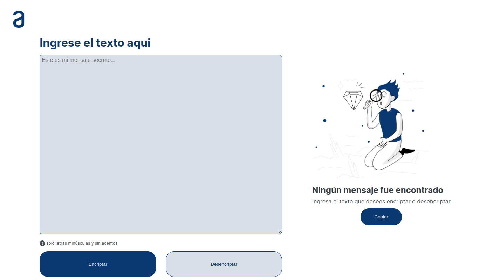
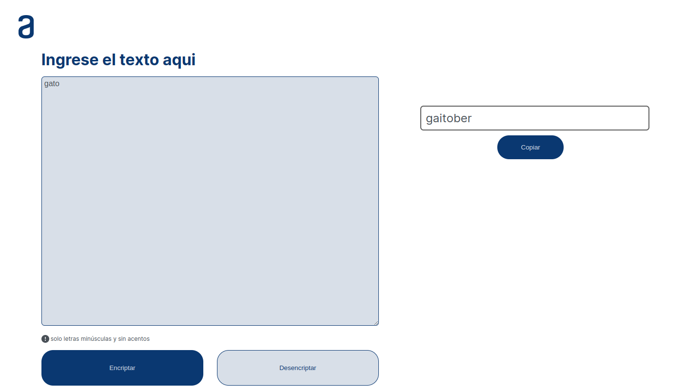
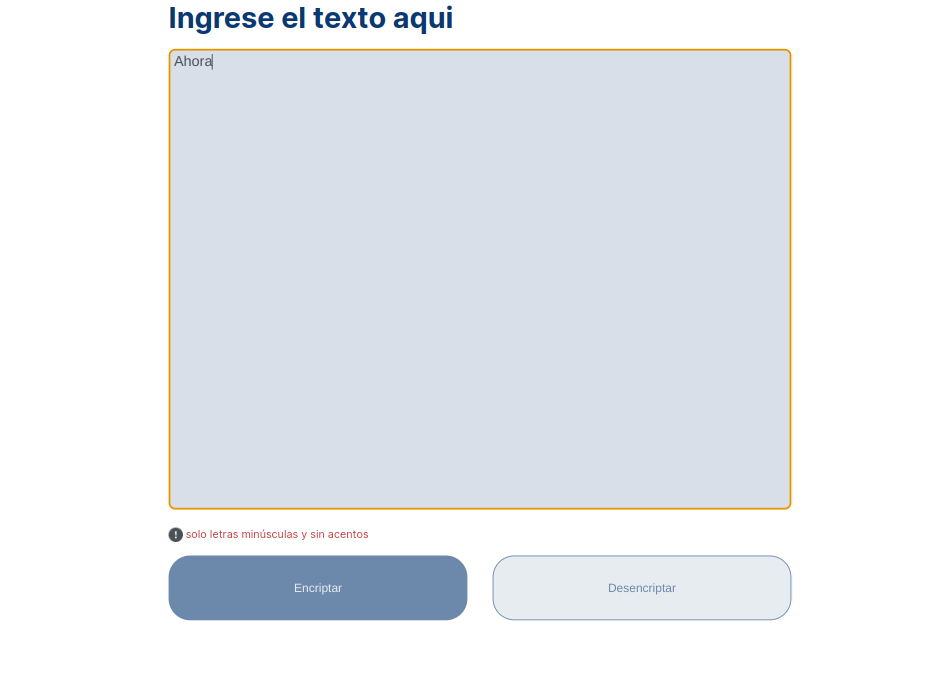
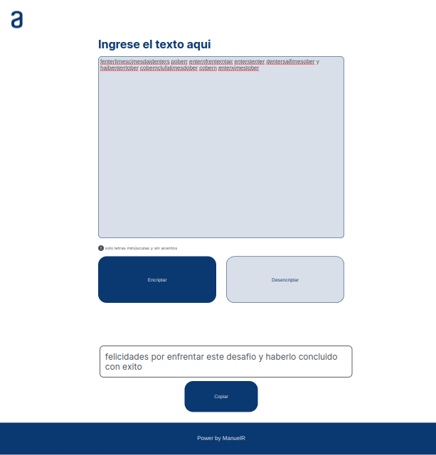
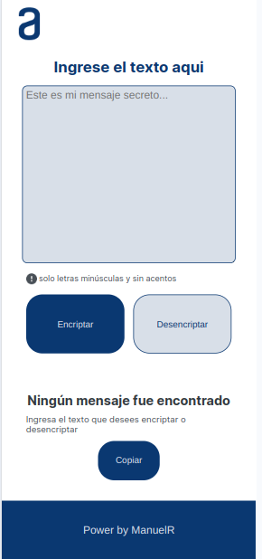
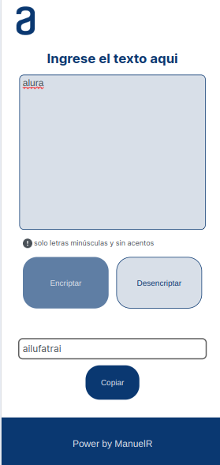

# Text Encryptor
Este proyecto es una aplicación web para encriptar y desencriptar mensajes. El usuario puede ingresar un texto y se permitirá encriptar o desencriptar un mensaje. La encriptación solo admite letras de la A hasta la Z en minúscula y sin tildes u otro carácter especial. En caso de ingresar una letra en mayúscula o una tilde, los botones de encriptar-desencriptar se inhabilitarán hasta que el usuario corrija la entrada y tambien el mensaje informativo cambia a un tono rojo para resaltarse. El proyecto es responsive (permite vistas para múltiples dispositivos) y, de manera adicional, cuenta con un botón que permite al usuario copiar el mensaje encriptado o desencriptado.

## Vistas Desktop

## Vistas Tablet

## Vistas Movil

